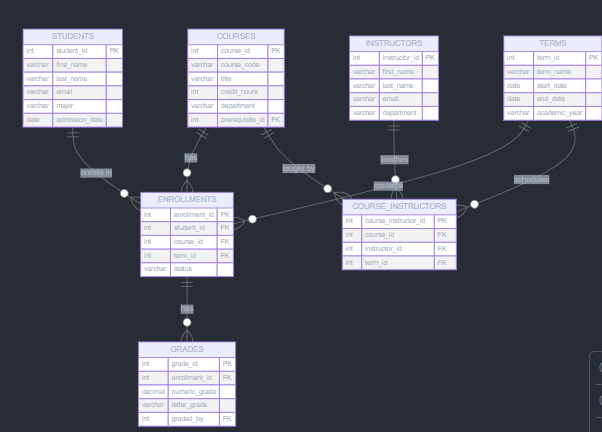
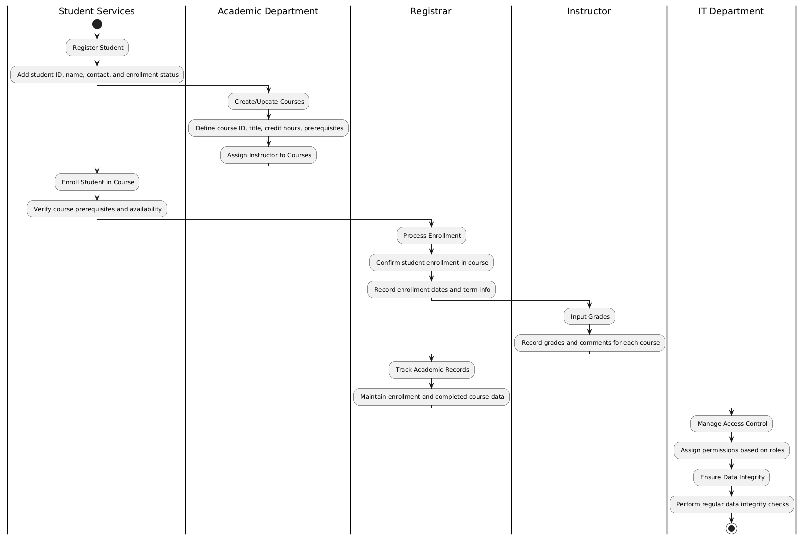
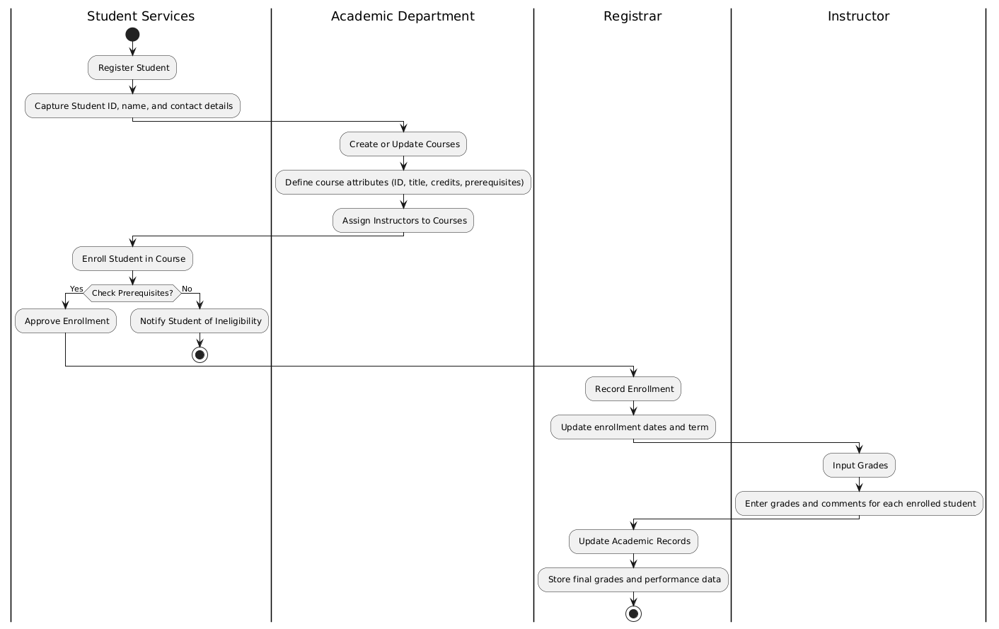
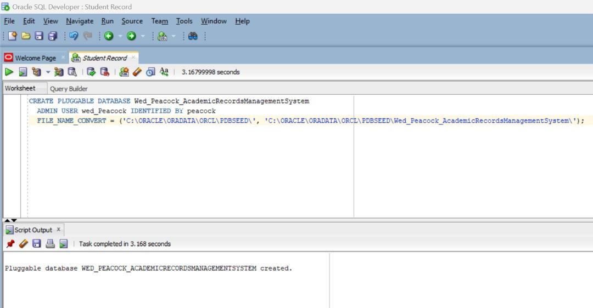
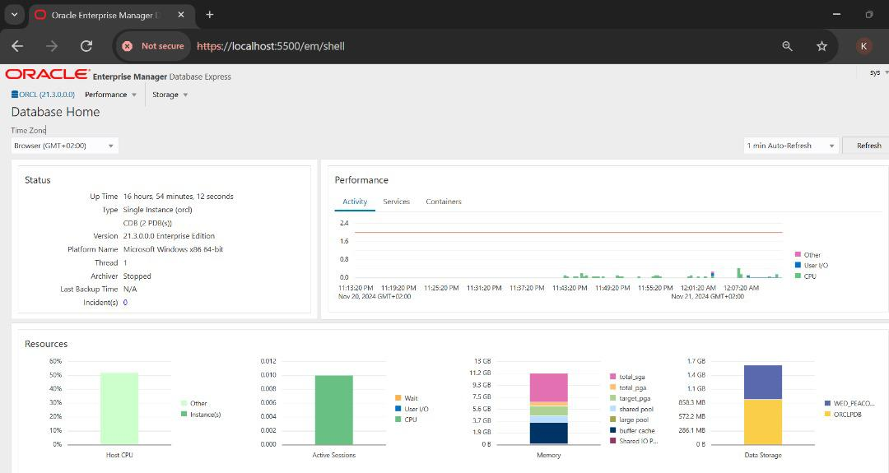

# Academic Records Management System (ARMS)

---

## Team Members

| **Name**                  | **ID**   |
|---------------------------|----------|
| **Bora Musoni Herve**     | 24618    |
| **Hakizimana Ghislain**   | 25411    |
| **Rocky Kayitare**        | 24353    |
| **Habimana Daniel**       | 25111    |
| **Cyiza Kayitare Sabine** | 24801    |
| **Adolphe Uwayo**         | 25743    |
| **Gatete Bertrand**       | 25958    |
| **Niyonkuru Valens**      | 25097    |
| **Manzi Munyambanza Darius** | 25491 |
| **Hirwa Clement Rhodin**  | 25787    |
| **Karungi Rebecca**       | 26681    |

---

## Project Overview

The **Academic Records Management System (ARMS)** is designed to modernize and simplify the management of academic data within educational institutions. ARMS enhances **efficiency**, **accessibility**, and **data accuracy**, ensuring secure and reliable handling of academic records for all stakeholders, including students, instructors, and administrators.

---

## Problem Statement

### Challenges in Current Systems
- **Manual Management**: Labor-intensive processes prone to delays.
- **Error-Prone Systems**: High risk of data inaccuracies.
- **Limited Scalability**: Inability to meet modern academic needs.

### Proposed Solution
The **Academic Records Management System (ARMS)** offers:
- **Automation**: Streamlined processes for data handling.
- **Centralization**: Unified platform for all academic data.
- **Improved Accessibility**: Role-based access for students, instructors, and administrators.

---

## Project Objectives

1. **Centralized Data Storage**: A unified database to manage student information, courses, grades, and instructor data.
2. **Role-Based Accessibility**: Secure and transparent access for all stakeholders.
3. **Data Integrity**: Automated processes to maintain accurate and consistent records.
4. **Enhanced Analytics**: Tools for academic planning and performance tracking.

---

## Project Phases Summary

### **Phase 2: Business Process Modeling**
- **Focus**: Identify and map workflows like enrollment, grading, and instructor assignments.
- **Techniques**: 
  - **Swimlane Diagrams**: Define task responsibilities.
  - **BPMN Diagrams**: Visualize workflows.

**Deliverables**:
- `PHASE 2.docx`: Detailed business processes.
- `swimlanes.png`: Role-based task distribution.
- `bpmn.png`: Workflow visualization.

### **Phase 3: Logical Model Design**
- **Focus**: Design a logical database model with entities, relationships, and constraints.

**Deliverables**:
- `PHASE 3.docx`: Comprehensive database models.
- `FLOW_DIAGRAM.PNG`: Visualization of data structure.

---

## Repository Contents

### Documents
- `PHASE 2.docx`: Business process documentation.
- `PHASE 3.docx`: Logical database design.

### Diagrams
1. **Flow Diagram**  
     

2. **Swimlane Diagram**  
     

3. **BPMN Diagram**  
     
## PHASE 4
### Database Setup
1. **Pluggable Database**  
    

2. **Oracle Enterprise Manager**  
     

---
## PHASE 5 & 6
## SQL Queries

### Creating Tables

```sql
-- Create Students table
CREATE TABLE Students (
    student_id INT PRIMARY KEY,
    name VARCHAR(100) NOT NULL,
    contact_info VARCHAR(255),
    enrollment_status VARCHAR(20) CHECK (enrollment_status IN ('Active', 'Inactive', 'Graduated')),
    enrollment_date DATE
);

-- Create Courses table
CREATE TABLE Courses (
    course_id INT PRIMARY KEY,
    title VARCHAR(100) NOT NULL,
    credit_hours INT CHECK (credit_hours > 0),
    prerequisites VARCHAR(255)
);

-- Create Instructors table
CREATE TABLE Instructors (
    instructor_id INT PRIMARY KEY,
    name VARCHAR(100) NOT NULL,
    department VARCHAR(100)
);

-- Create Enrollments table
CREATE TABLE Enrollments (
    enrollment_id INT PRIMARY KEY,
    student_id INT NOT NULL,
    course_id INT NOT NULL,
    enrollment_date DATE,
    term VARCHAR(20),
    FOREIGN KEY (student_id) REFERENCES Students(student_id) ON DELETE CASCADE,
    FOREIGN KEY (course_id) REFERENCES Courses(course_id) ON DELETE CASCADE,
    UNIQUE (student_id, course_id)
);

-- Create Grades table
CREATE TABLE Grades (
    grade_id INT PRIMARY KEY,
    student_id INT NOT NULL,
    course_id INT NOT NULL,
    grade CHAR(2) CHECK (grade IN ('A', 'B', 'C', 'D', 'F', 'P')),
    term VARCHAR(20),
    comments TEXT,
    FOREIGN KEY (student_id) REFERENCES Students(student_id) ON DELETE CASCADE,
    FOREIGN KEY (course_id) REFERENCES Courses(course_id) ON DELETE CASCADE,
    UNIQUE (student_id, course_id, term)
);
```
### Inserting data into tables

```sql

-- Insert students using subqueries from another table 
INSERT INTO Students (student_id, name, contact_info, enrollment_status, enrollment_date)
SELECT 
    1, 'Alice Johnson', 'alice@example.com', 'Active', '2022-08-15'
UNION ALL
SELECT 
    2, 'Bob Smith', 'bob@example.com', 'Active', '2021-09-12'
UNION ALL
SELECT 
    3, 'Charlie Davis', 'charlie@example.com', 'Graduated', '2020-05-20'
UNION ALL
SELECT 
    4, 'Diana Clark', 'diana@example.com', 'Active', '2023-01-10'
UNION ALL
SELECT 
    5, 'Ethan Wright', 'ethan@example.com', 'Inactive', '2022-03-01';

-- Insert courses using UNION to add multiple rows
INSERT INTO Courses (course_id, title, credit_hours, prerequisites)
SELECT 
    1, 'Database Management Systems', 3, 'Introduction to Programming'
UNION ALL
SELECT 
    2, 'Data Structures and Algorithms', 4, 'Programming Fundamentals'
UNION ALL
SELECT 
    3, 'Artificial Intelligence', 3, 'Data Structures and Algorithms'
UNION ALL
SELECT 
    4, 'Operating Systems', 3, 'Introduction to Programming'
UNION ALL
SELECT 
    5, 'Computer Networks', 3, 'Operating Systems';

-- Inserting multiple records separately for better readability
INSERT INTO Enrollments (enrollment_id, student_id, course_id, enrollment_date, term)
VALUES (1, 1, 1, '2022-08-15', 'Fall 2022');

INSERT INTO Enrollments (enrollment_id, student_id, course_id, enrollment_date, term)
VALUES (2, 2, 2, '2021-09-12', 'Spring 2021');

INSERT INTO Enrollments (enrollment_id, student_id, course_id, enrollment_date, term)
VALUES (3, 3, 3, '2020-05-20', 'Fall 2019');

INSERT INTO Enrollments (enrollment_id, student_id, course_id, enrollment_date, term)
VALUES (4, 4, 4, '2023-01-10', 'Spring 2023');

INSERT INTO Enrollments (enrollment_id, student_id, course_id, enrollment_date, term)
VALUES (5, 5, 5, '2022-03-01', 'Summer 2022');
-- Omitting the `comments` field if it allows NULL (assuming the column allows it to be null)

-- Inserting records into Grades table

INSERT INTO Grades (grade_id, student_id, course_id, grade, term)
VALUES 
    (1, 1, 1, 'A', 'Fall 2022'),
    (2, 2, 2, 'B', 'Spring 2021'),
    (3, 3, 3, 'A', 'Fall 2019'),
    (4, 4, 4, 'C', 'Spring 2023'),
    (5, 5, 5, 'B', 'Summer 2022');

-- Inserting records into Courses_Instructors table

INSERT INTO Courses_Instructors (course_instructor_id, course_id, instructor_id)
VALUES (1, 1, 1);

INSERT INTO Courses_Instructors (course_instructor_id, course_id, instructor_id)
VALUES (2, 2, 2);

INSERT INTO Courses_Instructors (course_instructor_id, course_id, instructor_id)
VALUES (3, 3, 3);

INSERT INTO Courses_Instructors (course_instructor_id, course_id, instructor_id)
VALUES (4, 4, 4);

INSERT INTO Courses_Instructors (course_instructor_id, course_id, instructor_id)
VALUES (5, 5, 5);

-- Inserting records into Department table

-- Insert record for Computer Science Department
INSERT INTO Department (department_id, department_name)
VALUES (1, 'Computer Science');

-- Insert record for Mathematics Department
INSERT INTO Department (department_id, department_name)
VALUES (2, 'Mathematics');

-- Insert record for History Department
INSERT INTO Department (department_id, department_name)
VALUES (3, 'History');

-- Insert record for Physics Department
INSERT INTO Department (department_id, department_name)
VALUES (4, 'Physics');

-- Insert record for Literature Department
INSERT INTO Department (department_id, department_name)
VALUES (5, 'Literature');
```
### Deleting data from tables

```sql

-- Remove a student record
DELETE FROM Students
WHERE student_id = 5;

-- Remove a course record
DELETE FROM Courses
WHERE course_id = 5;

-- Delete an enrollment record
DELETE FROM Enrollments
WHERE enrollment_id = 3;

-- Delete a grade record
DELETE FROM Grades
WHERE grade_id = 4;

-- Remove a course-instructor relationship
DELETE FROM Courses_Instructors
WHERE course_instructor_id = 2;

-- Remove a department
DELETE FROM Department
WHERE department_id = 5;
```

### Updating records into tables

```sql

-- Update contact information for a student
UPDATE Students
SET contact_info = 'alice.johnson@example.com'
WHERE student_id = 1;

-- Change enrollment status of a student
UPDATE Students
SET enrollment_status = 'Inactive'
WHERE student_id = 5;

-- Update credit hours for a course
UPDATE Courses
SET credit_hours = 4
WHERE course_id = 4;

-- Change the title of a course
UPDATE Courses
SET title = 'Advanced Operating Systems'
WHERE course_id = 4;

-- Update the term for a specific enrollment
UPDATE Enrollments
SET term = 'Winter 2023'
WHERE enrollment_id = 4;

-- Change the course for an enrollment
UPDATE Enrollments
SET course_id = 3
WHERE enrollment_id = 5;

-- Update a student's grade
UPDATE Grades
SET grade = 'A+'
WHERE grade_id = 2;

-- Add a comment for a grade
UPDATE Grades
SET comments = 'Excellent'
WHERE grade_id = 1;

-- Change the instructor for a course
UPDATE Courses_Instructors
SET instructor_id = 5
WHERE course_instructor_id = 3;

-- Update course assignment for an instructor
UPDATE Courses_Instructors
SET course_id = 2
WHERE course_instructor_id = 4;

-- Update the department name
UPDATE Department
SET department_name = 'Modern Literature'
WHERE department_id = 5;

-- Correct a typo in the department name
UPDATE Department
SET department_name = 'Computer and Information Science'
WHERE department_id = 1;
```

### Displaying records from different tables

```sql
-- Cross Join
SELECT 
    Students.name AS student_name,
    Courses.title AS course_title
FROM 
    Students
CROSS JOIN Courses;

-- Inner Join
SELECT 
    Students.name AS student_name,
    Courses.title AS course_title
FROM 
    Enrollments
INNER JOIN Students ON Enrollments.student_id = Students.student_id
INNER JOIN Courses ON Enrollments.course_id = Courses.course_id;

-- Left Join
SELECT 
    Students.name AS student_name,
    Enrollments.course_id AS enrolled_course_id
FROM 
    Students
LEFT OUTER JOIN Enrollments ON Students.student_id = Enrollments.student_id;

-- Right Join
SELECT 
    Courses.title AS course_title,
    Enrollments.student_id AS student_enrolled
FROM 
    Courses
RIGHT OUTER JOIN Enrollments ON Courses.course_id = Enrollments.course_id;
```
# PHASE 7 
The **Academic Records Management System (ARMS)** is a database solution designed to manage academic data efficiently and securely. It incorporates advanced database programming techniques like triggers, cursors, functions, packages, and auditing mechanisms to automate workflows, enforce institutional rules, and ensure data security.

## Features

1. **Triggers**: Enforce business rules and automate tasks.
2. **Cursors**: Process data row-by-row for detailed operations.
3. **Functions**: Encapsulate logic for modular, reusable calculations.
4. **Packages**: Organize related database operations for maintainability.
5. **Auditing**: Track database changes for accountability.
   
    ### Triggers
   **Purpose:** Automate data validation and enforce business rules.

#### Example: Validate Enrollment Status

```sql
CREATE OR REPLACE TRIGGER check_enrollment_status
BEFORE INSERT ON Students
FOR EACH ROW
BEGIN
    IF :NEW.enrollment_status NOT IN ('Active', 'Inactive', 'Graduated') THEN
        RAISE_APPLICATION_ERROR(-20001, 'Invalid enrollment status!');
    END IF;
END;
/
```
### CursorS

**Purpose:** Process data row-by-row for detailed operations.

#### Example: Generate Student Enrollment Report

```sql
DECLARE
    CURSOR student_cursor IS
        SELECT student_id, name 
        FROM Students s
        JOIN Enrollments e 
        ON s.student_id = e.student_id
        WHERE e.term = 'Fall 2022';
    student_record student_cursor%ROWTYPE;
BEGIN
    OPEN student_cursor;
    LOOP
        FETCH student_cursor INTO student_record;
        EXIT WHEN student_cursor%NOTFOUND;
        DBMS_OUTPUT.PUT_LINE('Student: ' || student_record.name || ' (ID: ' || student_record.student_id || ')');
    END LOOP;
    CLOSE student_cursor;
END;
/
```
### Packages

**Purpose:** Group related procedures and functions for modularity and maintainability.

#### Example: Package Specification

```sql
CREATE OR REPLACE PACKAGE academic_utils IS
    PROCEDURE log_student_activity(student_id_in INT);
    FUNCTION calculate_gpa(student_id_in INT) RETURN NUMBER;
END academic_utils;
/
```
### Functions

**Purpose:** Provide modular, reusable logic for tasks that require specific calculations or operations.

#### Example: Function to Calculate Average Grade for a Course

```sql
CREATE OR REPLACE FUNCTION calculate_average_grade (course_id_in INT)
RETURN NUMBER IS
    avg_grade NUMBER;
BEGIN
    SELECT AVG(CASE grade 
               WHEN 'A' THEN 4 
               WHEN 'B' THEN 3 
               WHEN 'C' THEN 2 
               WHEN 'D' THEN 1 
               ELSE 0 END)
    INTO avg_grade
    FROM Grades
    WHERE course_id = course_id_in;
    RETURN avg_grade;
END;
/
```
### Auditing

**Purpose:** Track and restrict changes to sensitive data for accountability.

#### Example: Audit Student Table Changes

```sql
CREATE OR REPLACE TRIGGER audit_students_changes
AFTER UPDATE OR DELETE ON Students
FOR EACH ROW
BEGIN
    INSERT INTO AuditLog (action, student_id, change_date)
    VALUES (CASE 
               WHEN DELETING THEN 'DELETE'
               ELSE 'UPDATE' 
            END, :OLD.student_id, SYSDATE);
END;
/
```

### Scope and Limitations
Scope:

Triggers enforce business rules and maintain consistency.
Cursors process complex operations row by row.
Functions and packages improve reusability and modularity.
Auditing enhances security by tracking changes.

## Limitations:

Triggers can introduce performance overhead during bulk operations.
Cursors are less efficient compared to set-based operations.
Complex auditing may require additional storage and processing.

Documentation and Demonstration for Academic Records Management System (ARMS)
Report

### Problem Statement and Rationale
The Academic Records Management System (ARMS) handles sensitive student data, requiring advanced database programming techniques to ensure accurate, secure, and efficient operations. To meet these requirements:

Triggers: Enforce business rules, such as ensuring valid enrollment statuses and data consistency.
Cursors: Allow row-by-row operations, such as processing audit logs for database changes.
Functions: Encapsulate logic for tasks like GPA calculation, enhancing code modularity.
Packages: Organize related procedures and functions for better maintainability and reusability.
Auditing: Track and restrict changes to sensitive data, ensuring transparency and accountability.

### Implementation Details
a) Triggers
Purpose: Automatically enforce business rules and maintain data integrity when specific database actions occur.
Use Cases:
Validating enrollment status during data insertion or updates.
Ensuring grades entered are within a valid range.
Logging actions in the audit table after data changes.
b) Cursors
Purpose: Handle row-by-row processing for tasks requiring detailed attention to individual database records.
Use Cases:
Iterating through grade records to generate audit entries.
Processing student course enrollments for custom reporting.
c) Functions
Purpose: Provide modular, reusable logic for tasks that require specific calculations or operations.
Use Cases:
Calculating a student’s GPA based on grades and credit hours.
Determining the number of credit hours a student has completed.
d) Packages
Purpose: Group related procedures, functions, and variables into a single unit for better code organization and security.
Use Cases:
Managing student-related operations such as adding a student or retrieving their status.
Creating a central package for all auditing operations to ensure consistency.
e) Auditing
Purpose: Monitor and log database activities, ensuring accountability and compliance with security standards.
Use Cases:
Tracking changes to sensitive fields like grades or enrollment status.
Logging user actions for later review and accountability.
Restricting data access based on user roles.

### Demonstration
1. Triggers in Action
Demonstrate how inserting or updating a student with invalid enrollment status is prevented.
Show triggers that log changes to grades or student details into the audit table.
2. Row-by-Row Cursor Processing
Illustrate how cursors are used to process audit entries for each grade change, generating detailed logs.
3. Modular Functions
Demonstrate a function that calculates GPA for a selected student, showcasing accuracy and modularity.
4. Package Usage
Highlight the use of packages to streamline operations, such as adding new students or managing course enrollments.
5. Audit Logs
Show audit logs capturing actions like grade changes or sensitive data updates.
Demonstrate how role-based restrictions ensure only authorized users can modify specific records.
